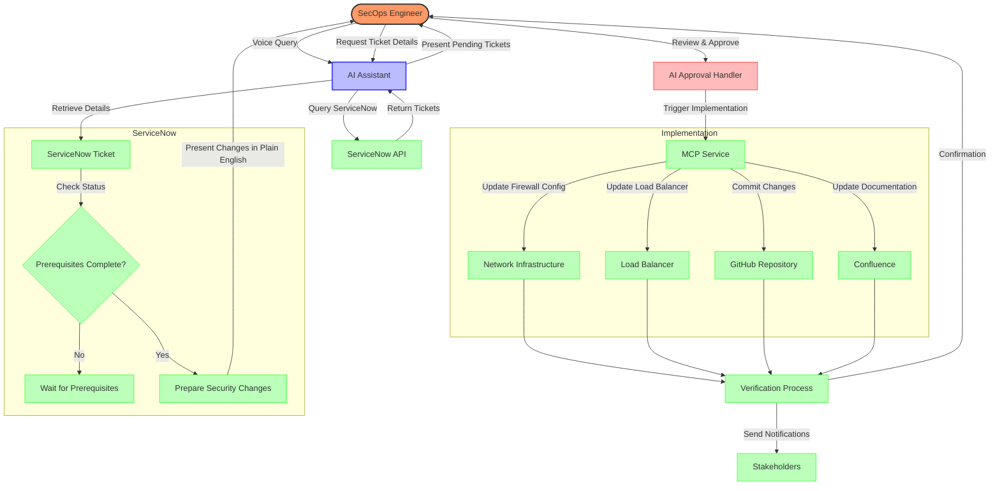

```mermaid
flowchart TB
    Start([SecOps Engineer]) -->|Voice Query| A[AI Assistant]
    A -->|Query ServiceNow| B[ServiceNow API]
    B -->|Return Tickets| A
    A -->|Present Pending Tickets| Start
    Start -->|Request Ticket Details| A
    A -->|Retrieve Details| C[ServiceNow Ticket]
    
    subgraph ServiceNow
    C -->|Check Status| D{Prerequisites Complete?}
    D -->|No| E[Wait for Prerequisites]
    D -->|Yes| F[Prepare Security Changes]
    end
    
    F -->|Present Changes in Plain English| Start
    Start -->|Review & Approve| G[AI Approval Handler]
    
    G -->|Trigger Implementation| H[MCP Service]
    
    subgraph Implementation
    H -->|Update Firewall Config| I[Network Infrastructure]
    H -->|Update Load Balancer| J[Load Balancer]
    H -->|Commit Changes| K[GitHub Repository]
    H -->|Update Documentation| L[Confluence]
    end
    
    I & J & K & L --> M[Verification Process]
    M -->|Send Notifications| N[Stakeholders]
    M -->|Confirmation| Start
    
    classDef human fill:#f96,stroke:#333,stroke-width:2px;
    classDef ai fill:#bbf,stroke:#33f,stroke-width:2px;
    classDef system fill:#bfb,stroke:#3f3,stroke-width:1px;
    classDef critical fill:#fbb,stroke:#f33,stroke-width:1px;
    
    class Start human;
    class A,G ai;
    class B,C,D,E,F,H,I,J,K,L,M,N system;
    class G critical;
```